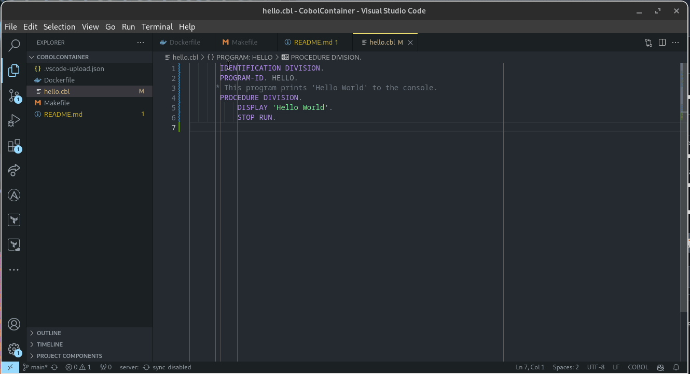

# cobol-container

An experiment to run cobol in kuberneties, or even locally

## Build

```bash
[nd@nd-box CobolContainer]$ make build
[+] Building 0.1s (11/11) FINISHED                                                                                                 docker:default
 => [internal] load build definition from Dockerfile                                                                                         0.0s
 => => transferring dockerfile: 504B                                                                                                         0.0s
 => [internal] load .dockerignore                                                                                                            0.0s
 => => transferring context: 2B                                                                                                              0.0s
 => [internal] load metadata for quay.io/centos/centos:stream9                                                                               0.1s
 => [1/6] FROM quay.io/centos/centos:stream9@sha256:cfc4665de53f6a17a35d197c9f64f334c1a934a885a30859c89b49ff183185af                         0.0s
 => [internal] load build context                                                                                                            0.0s
 => => transferring context: 90B                                                                                                             0.0s
 => CACHED [2/6] RUN dnf install https://dl.fedoraproject.org/pub/epel/epel-release-latest-9.noarch.rpm -y                                   0.0s
 => CACHED [3/6] RUN dnf --disablerepo="*" --enablerepo="epel"                                                                               0.0s
 => CACHED [4/6] RUN dnf install gnucobol -y                                                                                                 0.0s
 => CACHED [5/6] COPY hello.cbl ./                                                                                                           0.0s
 => CACHED [6/6] RUN cobc -x -o hello hello.cbl                                                                                              0.0s
 => exporting to image                                                                                                                       0.0s
 => => exporting layers                                                                                                                      0.0s
 => => writing image sha256:f2b87a7f9b3382b1a10157d3688232ec972685450b9ba8644c6ebecf441e96ac                                                 0.0s
 => => naming to docker.io/library/cobolcontainer                                                                                            0.0s
[nd@nd-box CobolContainer]$ 
```


## Run

```bash
[nd@nd-box CobolContainer]$ make run
Hello World
[nd@nd-box CobolContainer]$ 
```

## Video

